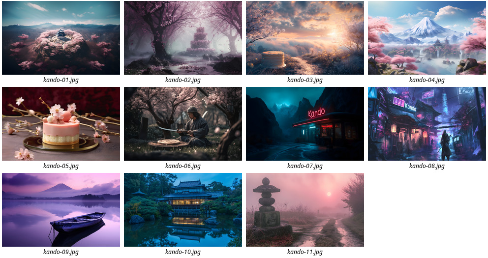
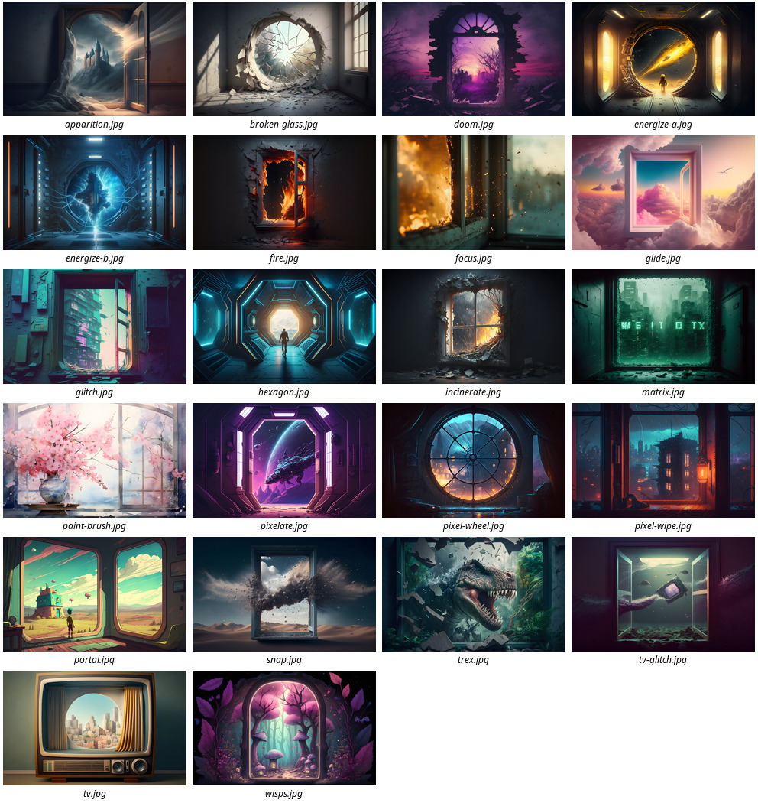
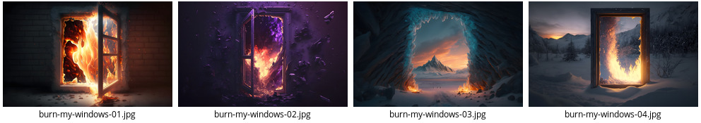

# AI-Generated Wallpapers

All wallpapers in this repository were generated with [Midjourney](https://www.midjourney.com) and upscaled with [Upscaler](https://flathub.org/apps/details/io.gitlab.theevilskeleton.Upscaler).
All wallpapers are free to use under the terms of the [CC-BY 4.0](https://creativecommons.org/licenses/by/4.0/) license.

## Wallpapers for [Kando](https://github.com/kando-menu/kando)

[](kando)

## Wallpapers for the Effects of [Burn-My-Windows](https://github.com/Schneegans/Burn-My-Windows)

[](burn-my-windows-effects)

## Other [Burn-My-Windows](https://github.com/Schneegans/Burn-My-Windows) Wallpapers

[](burn-my-windows)

## Wallpapers inspired by the [Desktop Cube](https://github.com/Schneegans/Desktop-Cube) Extension

[](desktop-cube)

## Wallpapers inspired by the [Fly-Pie](https://github.com/Schneegans/Fly-Pie) Extension

[](fly-pie)


## Abstract Illustrations

[](abstract-illustrations)

## Notes

After upscaling the images, they were rescaled to 4k and converted to JPEG using this command:

```
mogrify -resize 3840x2400\! -quality 100 -format jpg *.png
```

The previews in this README were generated with [Image Magick](https://imagemagick.org/index.php) like this:

```
montage -label '%f' burn-my-windows/*.jpg -tile 4x5 -geometry 240x150+4+2 burn-my-windows.jpg
```
